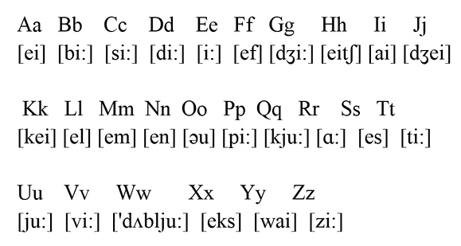
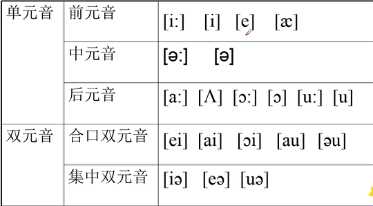
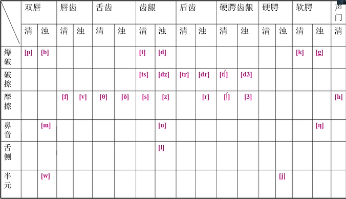

[toc]

# 语音

​                                                                   
$$
*二十六字母读音*
$$

## 元音和辅音 

### 元音和辅音的定义：

#### 元音：  

声带振动，气流不受阻碍 

#### 辅音： 

气流受到一定的阻碍

#### 清辅音： 

声带不振动的辅音

#### 浊辅音： 

声带振动的辅音 

### 元音： （20个）

### 辅音：（28个）

