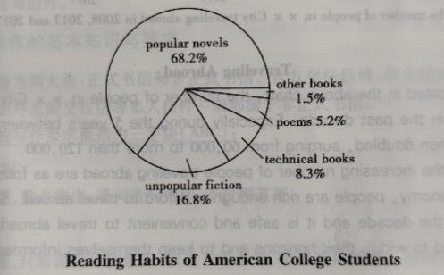

# 作文技巧

## 作文

### 图表类写作

1. descirption 
    1. figures --> 比较级 
    2. compare 对比
    3. contrast 对照
2. analysis -- reason 原因 
3. conclusion + settlement 
    1. good --> maintain 
    2. bad --> improve/resolve 

范文：

①Seen from the chart, it can be concluded that American college students prefer to read popular novels father than read other kinds of books. Among all the books the students read now, popular novels account for 68.2% while unpopular fiction makes up 16. 8%,technical books 8. 3% and poems only 5.2%.

②It is no wonder that popular novels have attracted so many readers. They are written in plain language So that one can easily read them for entertainment or relaxation. Books of technology and collections of poems are less appealing in that the former is often complicated and the latter abstract.

③In my own practice, I think it not advisable at all to read popular novels. On the one hand, I spend much of my free time reading books in my specialized field-- environmental protection. On the other hand, I take great delight in reading nonfiction such as history and biography so as to be wiser and more reasonable. To turn my dream into reality, I must cherish every minute of my life and work hard.

（1）从图表中可以得出结论，美国大学生更喜欢读父亲的通俗小说，而不是阅读其他类型的书籍。在学生现在阅读的所有书籍中，通俗小说占68.2%，非通俗小说占16%。8%，技术书籍 8.3%，诗歌只有5.2%。

（2）难怪通俗小说吸引了这么多读者。它们以通俗易懂的语言编写，因此人们可以轻松阅读它们以进行娱乐或放松。技术书籍和诗集的吸引力较小，因为前者往往很复杂，而后者是抽象的。

（3）在我自己的实践中，我认为阅读通俗小说根本不可取。一方面，我把大部分空闲时间花在我的专业领域——环境保护上。另一方面，我非常喜欢阅读历史和传记等非小说类书籍，以便更明智、更合理。把我的梦想变成现实， 我一定要珍惜生命中的每一分钟，努力工作。

## 推荐信

To Whom It May Concern,

  It affords me much pleasure to recommend John Smith, one of my former colleagues, to you.

  During his work in A. N. Y. Company, he was my assistant.

  As his direct leader, found him a most reliable and efficient member of the sales team.His performance in the work was outstanding.

  First, he was professional and efficient in his work and showed great talents in sales.

  In addition, he has a very pleasant personality.

Sincerely yours,

Penny Farthing    

Department Manager

我很高兴向您推荐我以前的同事之一约翰·史密斯。

  在A.N.Y.公司工作期间，他是我的助手。

  作为他的直接领导，发现他是销售团队中最可靠和最有效率的成员。他在工作中的表现非常出色。

  一是工作专业高效，在销售方面展现出过人的才华。

  此外，他的性格非常讨人喜欢。

### 模板

To Whom It May Concern, 

①It affords me much pleasure to recommend to you. 

②During his/her_______ in_______, he/she was my________.

③As his/her_____ 50 I found him/her________, I found him/her______. 

④His /Her performance in the _______was outstanding.

⑤First, he/she has been_______ and showed great talents in________

⑥In addition, he/she has a very pleasant personality,

⑦He / She has developed a strong_______, and working with him/her is always

⑧l can state that he/she has all the qualities of being_______.

⑨Therefore, I recommend him/her t0 you with all my heart. ⑩Your favorable consideration of his/her application will be most appreciated. I am sure that his/ her future performance will prove

worthy of your trust. If further information about his /her qualifications is needed, please feel free to contact me.

## 邀请信

Dear＿＿＿＿,

① ＿＿＿. It would be pleasant/honored to have you here. ⑤Will you join us/ give me the

 pleasure of your company?

④During the__,we will have lots of activities you are interested in＿＿＿ .⑤First ,＿＿.

⑥Second,＿＿＿.

⑦l know/believe that you will be very interested in＿＿＿.⑧＿＿＿.

⑨Moreover/What ‘s more/In addition,＿＿＿. ⑩The ＿＿＿would not be complete

 without you! ⑪Since the__ will begin＿＿＿,is it possible for us to meet＿＿＿＿?

⑫We do hope you can come.

​                                                               Sincerely yours,

Signature

Dear Jack,

①Next Wednesday, Sept.19, is my birthday and my parents will hold a birthday party for me in 

my house. ②lt would be pleasant to have you here. ③Will you join us?

④During the party,we will have lots of activities you are interested in.⑤First,we can have some snacks and fruits in my garden. ⑥Second,we can also sing the popular songs we like and enjoy

 the birthday cake.

⑦l believe that you will be very interested in this occasion. .⑧You are my best friend and my parents also want to see you .⑨In addition,we haven’t seen each other for a long time and I am eager to see you. a0The party would not be complete without you!

⑪Since the birthday party will begin at 7,30 p.m., is it possible for us to meet at 7：00on Wednesday evening in my house? ⑫We do hope you can come.

​                                                                 Sincerely yours, 

Thomas

（1）9月19日下周三是我的生日，父母将在

我的房子。（2）很高兴有你在这里。（3）你会加入我们吗？

（4）聚会期间，我们会有很多你感兴趣的活动（5）首先，我们可以在我的花园里吃一些小吃和水果。（6）其次，我们也可以唱自己喜欢和喜欢的流行歌曲

生日蛋糕。

（7）我相信你会对这个场合非常感兴趣。（8）你是我最好的朋友，我的父母也想见你.（9）另外，我们很久没有见面了，我很想见到你。a0没有你，派对就不完整！

（11）既然生日派对将在晚上7，30开始，我们是否可以在周三晚上7：00在我家见面？（12）希望你能来。

