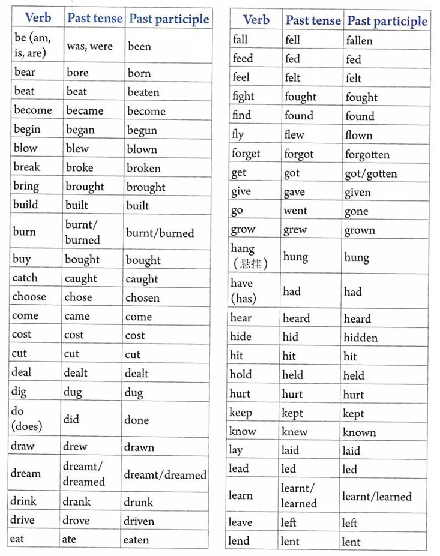
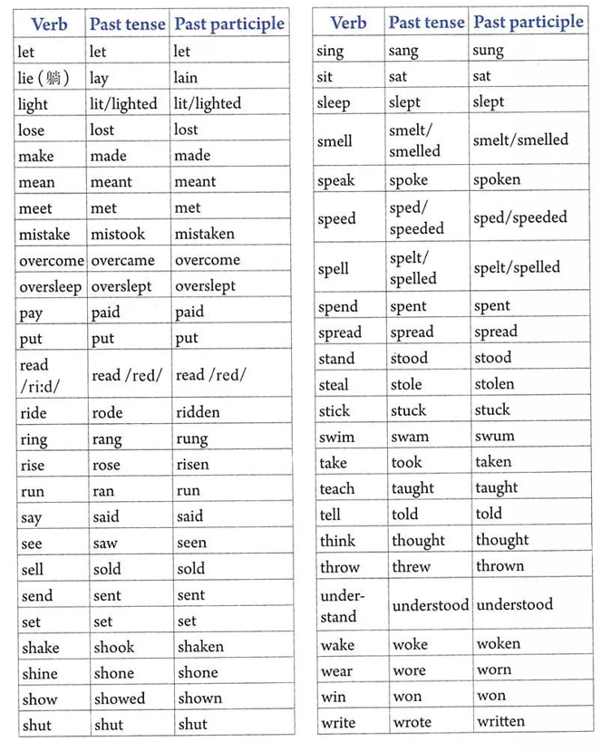
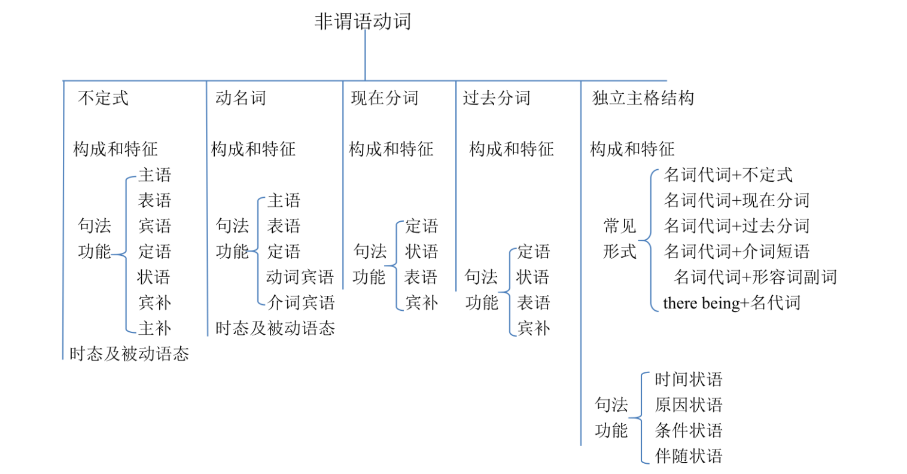
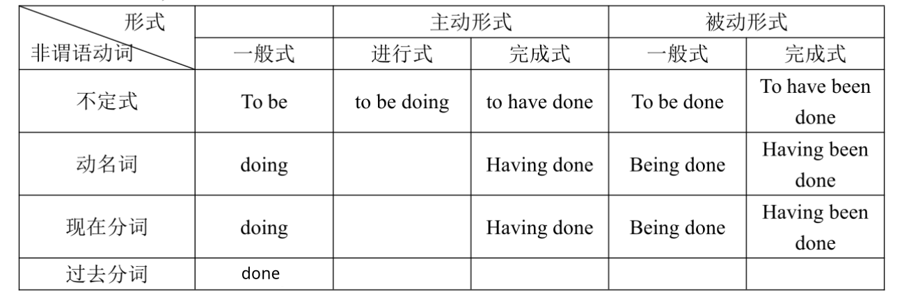
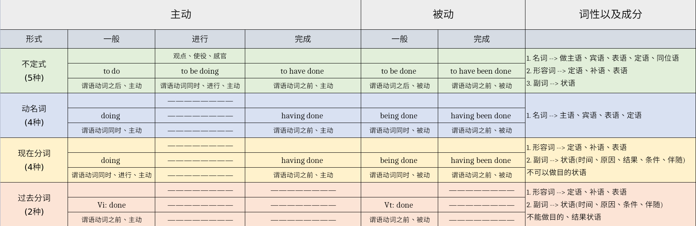
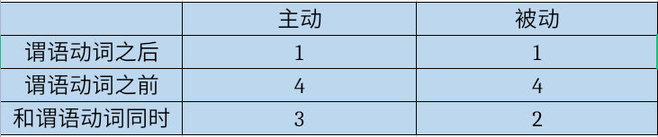
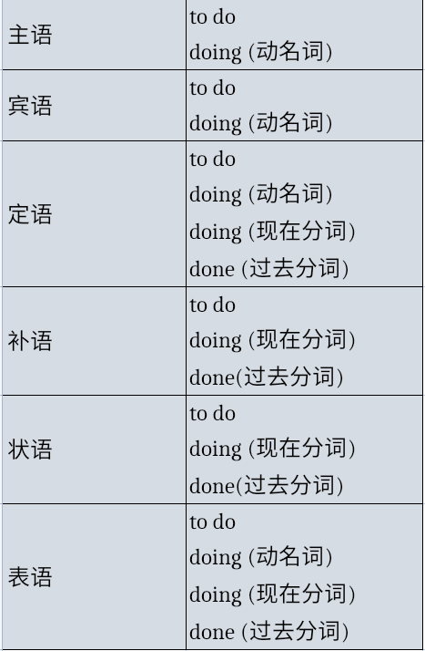
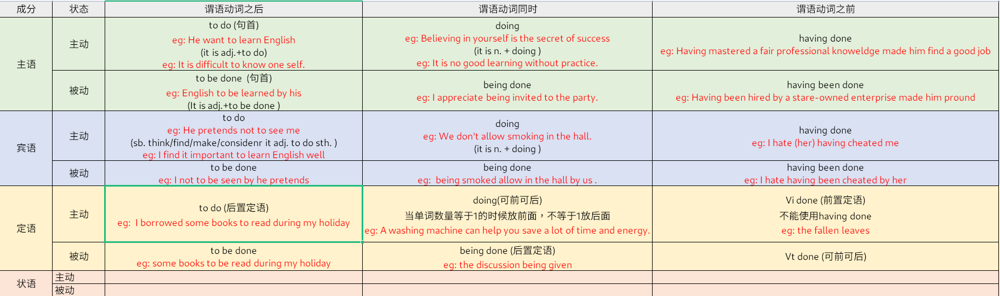

[toc]

#  动词：

*   定义：
    *   表示动作或者状态的词

*   eg：
    *   `The boy runs fast`
    *   `The boy is a student`

其中 is 和 runs 就是动词

## 动词的分类：

*   连系动词 -- be  ： 连系作用的 连接左右 

*   实义动词 -- love ： 有实在意思，有实际含义的一个动词  

*   助动词 -- do does did ： 帮助的作用 缺少成分  

*   情态动词 ： 有感情的动词，情感和态度强加给人  can /must

## 动词在句子中的成分

### 谓语动词

一个简单句有且只有一个谓语动词

当动词在句子中做谓语的时候，动词被成为谓语动词

最常见的谓语动词就是实义动词和be动词。

实义动词过去式也做谓语动词

### 非谓语动词

当动词在句子中不做谓语的时候，被称为非谓语动词。

$$
\cases{
& to\ do\ \ 动词不定式，表示一个不确定的事情\\
& doing\ \ 动名词、现在分词。可以表示一个动作也可以表示一个性质\\
& done\ \ 过去分词\\
}
$$
当动词出现以上情况的时候，动词一定做非谓语动词。判断动词是过去分词还是过去式，需要判断句子中是否出现谓语动词。

#### 现在分词和动名词的区别

$$
a\ \underbrace{sleeping}_{现在分词}\ dog\ :一个睡着的狗 \\ 

\\
a\ \underbrace{sleeping}_{动名词}\ bag\ :一个睡袋\\
$$

## 动词的基本形式：

### 一、主语作为第三人称单数的动词变化规则：

#### 1. 一般情况下，直接在动词后面加s

*   eg: 
    *   `get --> gets`
    *   `take --> takes`

#### 2. 以sh、ch、o、s、x结尾的动词，在词尾加es

*   eg: 
    *   `teach --> teaches`
    *   `fix --> fixes` 
    *   `go --> goes` 

#### 3.以辅音字母+y结尾的动词，变y为i再加es

*   eg: 
    *    `study --> studies` 
    *   `try --> tries`

#### 4. 特殊变化

*   eg: 
    *   `have --> has`
    *   `be --> is`
    *   `do --does`

#### 例题：

`He brushes teech every morning`

### 二、动词的现在分词：（一般用于现在进行时）

#### 1. 一般情况下，直接在动词后加ing

*   eg: 
    *   `work --> working`
    *   `sleep --> sleeping`

#### 2. 动词以不发音的e结尾的时候，去e再加ing

*   eg: 
    *   `take --> taking` 
    *   `make --> making` 

#### 3. 以辅元辅结尾的，要双写结尾的字母再加ing

*   eg: 
    *   `cut --> cutting `
    *   `put --> putting` 
    *   `swim --> swimming` 
    *   `get --> getting`

#### 4. 以ie结尾的，变ie为y再加ing 

*   eg: 
    *   `lie --> lying`
    *   `tie --> tying`

#### 5. 特殊：

*   eg: 
    *   `travel --> travelling` 
    *   `picnic --> picnicking`
    *   `control --> controlling` 

### 三、 过去式和过去分词的构成方法： 

#### 1. 一般情况下，直接在动词后+ed

*   eg: 
    *   `worked --> worked`
    *   `ask --> asked` 

#### 2. 动词以e结尾，直接在末尾加d 

*   eg: 
    *   `like --> liked`

#### 3. 以辅元辅结尾的，要双写结尾的字母再加ed 

*   eg: 
    *   `stop --> stopped` 
    *   `prefer --> preferred` 

#### 4. 以辅音字母+y结尾的动词，变y为i再加ed

*   eg： 
    *   `carry --> carried`

#### 5. 特殊：（不规则动词过去式过去分词变化表）

*   eg: 
    *   `control --> controlled` 
    *   `travel --> travelled`
    *   `picnic --> picnicked` 
    *   `leave --> left` 

## 动词的分类：

### 系动词：

用来帮助说明主语是什么、怎么样的动词

系动词本身具有词义，不能单独做谓语，后面必须跟表语（通常为名词或者是形容词）构成系表结构，说明主语的状况、性质、特征等情况。

#### 系动词分类：

##### 状态系动词 ： is are 等be动词

用来表示主语的性质或者状态，意思为：是

*   eg:
    *   `He is a student` 
    *   `He is ill ` 

##### 感官系动词： look 、soudn、smell、taste、feel、hear、rember、understand

用来表示人体感官的动词，这类动词加上形容词表示人或者事物的特征、性质或状态

*   eg: 
    *   `She look beautiful`

##### 持续系动词： keep、remember、stay、stand

表示持续发生

*   eg: 
    *   `The weather remains cold`

##### 终止系动词： prove、turn out

最终…… 

*   eg: 
    *   `The weather turned out to be fine`

##### 变化系动词： look、grow、get fall 、go 、become 、 turn

表示事物变得…… 

*   eg: 
    *   `His face truned red`

### 实义动词：

表示行为、动作、状态的动词，具有实际的意义，又称为行为动词

#### 及物动词

$$
V_t:及物动词\\
\\
I\ \underbrace{love}_{及物动词}\ you\\
$$

及物动词后可以直接加宾语，构成主谓宾结构,不可以直接加介词。

#### 不及物动词

$$
V_i:不及物动词\\
\\
I\ \underbrace{sleep}_{不及物动词}\\
$$

不及物动词后不能直接加宾语，需要借助其他介词才可以构成宾语

### 助动词：

帮助定义动词，构成各种时态和句型的动词，例如do、does、did 、will

### 情态动词：

表示说话人情感和态度的词，后接实义动词原形 

$$
V_{情态}+V_{原}
$$

### 常用情态动词

#### can , could , be able to，must

$$
can-->V_{过去式}-->could
$$

##### can

1.表示可以能够,有能力去做

2.可以去做某事 

语气通常带有命令性质，比较生硬

##### could

1.表示过去有能力做

2.表示现在或者将来的能够

3.不真实的事情 

4.could have done 过去可能做完，但是实际上并没有完成。 

5.could have done 过去可能做.(不常考)

6.couldn't have done 过去不可能做，但是实际上做了

7.couldn't have done 过去不可能做

可以作为can的过去式，用于一般过去时，也可以表示一种委婉的语气

could可以用于过去，也可以用于现在，用于现在的时候表示一种委婉的语气。

##### be able to

当需要动词和动词时态变化的时候，需要使用be able to 情态动词can和could不可以作为动词使用 

当有时态变化的时候，需要用`be able to`. 因为be动词可以随着时态而变化，拥有变化形式，但是can没有时态的变化，通常使用一般现在时

be able to也可以表示能够做完的事情已经做完

managed to do 表示没法成功做成某事

##### must，can't

对现在肯定的推测
$$
对于现在肯定或者否定的推测\\ 
				\\
must/can't
\begin{cases}
be            &(tired/hungry)\\
be-ing        &(doing/going) \\
get/know/have          \\
\end{cases}
$$
must: 表示觉得一定，主观肯定的推测

must have done 曾经肯定的推测

can't 表示觉得不可能，主观上的推测不可能 

can't have done 对于过去一件事情否定的推测

$$
对于过去肯定或者否定的推测 \\ 
						\\ 
must/can't\ \ +have 
\begin{cases}
been           &(asleep/at\ work)\\
been-ing       &(doing/looking) \\
gone/got/known  \\
\end{cases}
$$

##### may , might

1. 表示可能

may只能作为现在使用

might 是may的过去式，也可以作为现在使用，表示现在的可能性，也可以作为过去的时间使用，和can和could的用法一样

may not 可能不是

might not 可能不是

may be and maybe 

may和be隔开 may做情态动词使用，但是连接在一起则不是情态动词
$$
may/might+(not)
\begin{cases}
be 		&(true/in\ his\ office ) \\ 
be-ing	&(doing/working/having) \\ 
know/work/want 
\end{cases}
$$

may/might have done 可能性的猜测

$$
may/might + (not)have
\begin{cases}
been  (asleep /at\ home )\\ 
been-ing (doing / working /feling ) \\ 
known / had/ wanted /left 
\end{cases}
$$

2. 表示将来的可能性

`I haven't decided where to go on holidya . i may go to Ireland` 

`Take an umbrella with you . it might rain later`

如果加not则表示否定，对表示将来的事情可能不做

##### have to , must

have to 可以和情态动词连用，自身不是情态动词 

have to 不得不 可以随着时态的变化而变化，不是主观意愿，被迫的行为

`I have to wear glasses for reading` 

`You can't turn right here .You have to turn left`

do/does/did have to 没有必要做 (have to的否定，有时态的变化)

`What do I have to do to get a new driving licence`

 

I'll have to , I'm going to have to , I might have to , I may have to 

`They can't repair my computer,so I'll have to buy a new one`

must 表示很肯定，或者强行要求

`You must keep this a secret` 

mustn't 不能够,禁止做 

`You mustn't tell anyone`

##### must , mustn't , needn't 

must 一定要做

mustn't 一定不要做 

need:

1. 情态动词

need + (not) + $V_{原}$  (不)需要

`You need get up early` 

`You needn't get up early` 

2.实义动词

need to 可以进行各种事态的变化

`I need to get up early` 

`I don't need to get up early` 

needn't have done 过去没必要担心，但是实际担心了

`He needn't have done something`

didn't need to 不需要做，陈述事实

`He didn't need to do something `

## 特殊情态动词：should

### should一般用法

$$
should\ + \ V_{原} \\ 
shouldn't\ + \ V_{原}
$$

1. should 应该

有时会加一个I think 

`I think the govemment should do more to improve schools` 

`You should work hard` 

shouldn't 不应该

`You shouldn't play game during the class`

`Should you work hard ?`

* `What should you learn `
    * `I think you should `

should have done 过去应该做，实际没有做

`We should have worked hard during the online class`

shouldn't have done 过去不应该做，但是实际做了

`We shouldn't have played game during the class `

2. 表示不太肯定的猜测

`She should be his giftriend` 

### ought to == should 

$$
ought\ \ to\ + \ V_{原} \\
ought\ \ not\ \ to\ + \ V_{原}
$$
**肯定**

`You should work hard`

`You ought to work hard` 

**否定**

`You shouldn't play game during the class` 

`You ought to not play game during the class`

### 虚拟语气(下文内容仅限由should引出的虚拟语气)

#### 概念

说话人的主观愿望，假设，建议，祝福。

虚拟语气是说话者用来表示假设，或难以实现的情况，而非客观存在的事实，所陈述的是一个条件，不一定是事实，甚至完全与事实相反。此外如需表达主观愿望或某种强烈的感情时，也可用虚拟语气。虚拟语气通过谓语动词的特殊形式来表示。

#### 例句： 

1. 愿望： 

`I hope every one of you could pass the exam.` 

2. 假设

`If every of you were on time,I would be happy tomorrow.`

3. 建议

`I suggest that you (should) work hard ` 

4. 祝福

`I may you succeeded `

#### $V.$ 类用法

$$
V.+宾语从句(that\ \ sb./sth.\ \ [should]\ \ do\ \  ...)
$$

1. 坚持
    1. insist 
2. 要求
    1. ask
    2. demand 
    3. requite
    4. request
3. 建议
    1. demand 
    2. recommend
    3. suggest 
        1. suggest doing sth.
        2. suggess 后不能使用动词不定式 
    4. propose 
    5. advise
        1. advise sb to do sth.  
4. 命令
    1. order
    2. commend 

`I insisted that he apologise =(I insisted that he should apologise.)`

**上述单词，通常和should连用，should 后和$V_{原}$连用，should可以省略**

#### $adj.$ 类用法

$$
It's\ \ +\ adj.+宾语从句(that\ \ sb./sth.\ \ [should] \ \ do)
$$

important 重要的

vital 必不可少的

necessary 必要的

essential 必要的

`It's essential that you (should) work hard` 

**上述单词，通常和should连用，should 后和$V_{原}$连用，should可以省略**

#### if ... should

if倒装句， if的句子为从句

1. `If you understand ,please tell others`  如果你理解请告诉其他人 

2. `If you should understand ,please tell others` 理解的可能性比句1更小

3. `Should you understand ,please tell others`  和第二句的理解是一样，但是句子更简洁

 

`if the situation should change , we will contact you about a job`

`Should the situration change , we will contact you` 

### had better('d better), had better not('d better not)

had better + $V_{原}$ 最好怎么样

`You'd better focus on` 

had better not +$V_{原}$ 最好不

`You'd better not play 8 games during the class`

### it's time

1. 是...的时间了,后可以使用不定式to do --> It time (for $sb.$) to do 

`It's time (for us) to restart`

2. 单纯使用 $it's\ \ time\ \ that\ \ sb.\ \ +\ \ V_{过去式} +sth.$ 从句使用一般过去式，来表达现在，有督促、责怪的意味,使用过去式是因为在之前就应该执行某个动作，但是实际上却没有 

`It's late , It's time that we went home`

 

## 特殊情态动词 would

1. 将会
2. 想...

will的过去式为would  

would缩写为'd  

had better do  缩写为'd better do  

would like 缩写为'd like  

would + $V_{原}$  

would have done 过去会做，但是没有做 

wouldn't have done 1. 过去本不会 2. 过去不会做，但是其实做了 

`I would call Lisa, but I don't have her number `

`I would have called Lisa , but I didn't have her number ` 

`I'm not going to invite them to the party, They wouldn't come anyway.` 

`I didn't invite them to the party ,they wouldn't have come anyway`

1. would 作为will 的过去式的时候，可以表过去将来， 用法为 would do
2. 作为情态动词，表示过去的推测，would have done , 过去将会，但是实际上没有。 

3. would 用在一般将来时的时候，情况不可能发生，是作为一种假设。 

would ... if 

`I would call Lisa if I had her number` 

`I would have called Lisa if I'd had her number` 

## if I do , if I did

If I do 表示一种可能，常用结构主将从现

If I did  表示一种不可能的假设，常用结构would表示不可能用法

`If we take the bus , it will be cheaper` 主将从现 ,表示可能的假设

`We are going to take the train , If we took the bus , it would be cheaper ,but the train is quicker` 表示一种不可能发生的事情，使用了一种不可能的假设，使用了虚拟语气，同时采用了would在一般将来事态的一种表示不可能的用法。 

## 基本情态动词总结

### can , could , must , may , might , be able to , managed to , need , should 

### 表格：

|          |                                | 现在                                                         | 过去                                                         | 将来                                  |
| -------- | ------------------------------ | ------------------------------------------------------------ | ------------------------------------------------------------ | ------------------------------------- |
| 能力     | **能够**                       | can could am/is/are able to                        | could  was/were able to                                 | (can) could will be able to |
| 能力     | **不能够**                     | can't  could't  am/is/are not able to              | couldn't  was/were not able to                          | couldn't will not be able to     |
| 可能性   | **可能是**                     | can could may might                           | **could have done  (1.过去可能 2.过去本可以做，但是实际没有做[考点])**  may have done  might have done | could might may             |
| 可能性   | **可能不是**                   | may not  might not                                      | may not have done  might not have done                  | may not  might not               |
| 肯定推测 | **一定是**                     | must                                                    | must have done                                               | will                                  |
| 否定推测 | **一定不是** (**不可能**) | can't couldn't                                          | can't have done  **couldn't have done  (1.过去不可能 2.过去不可能但是实际做了[考点])** | will not                              |
|          | **禁止**                       | mustn't                                                      | ———————————————————————————————————————————                  | ———————————————————                   |
|          | **必须**                       | must  have/has to                                       | had to                                                       | ———————————————————                   |
|          | **需要**                       | need**(情态动词)** need/need to do**(实义动词)**        | needed to do**(实义动词)**                                   | ———————————————————                   |
|          | **不需要**                     | needn't**(情态动词)** don't/doesn't to do**(实义动词)** | **needn't have done(情态动词) (1.过去本不需要，实际上需要[考点])** didn't need to do**(实义动词)** | ———————————————————                   |
|          | **应该**                  | should ought to                                         | should have done  **(1. 过去本应该做，实际没有做[考点])** ought to have done **(1. 过去本应该做，实际没有做[考点])** | should ought to                  |
|          | **不应该**                     | shouldn't  ought not to                                 | shouldn't have done  **(1. 过去本不应该做，实际做了[考点])** ought not to have done **(1. 过去本不应该做，实际做了[考点])** | shouldn't  ought not to          |

$$
成功做成了某事
\begin{cases} 
was/were\ able\ to  \\ 
managed\ to 
\end{cases}
$$

## Would

### 1. 过去将来时（站在过去对将来的一种规划）

#### would do（表示过去将来会发生）

此用法would为will的过去式

`He told me that he would hand in hand with her yesterday`

#### would have done（过去将会发生，但是实际上没有）

此用法为虚拟语气**[考点]** ，如果衔接if从句，从句用过去完成时。  

`If I had worked harder，I would have got good grades` 

#### wouldn't have done (过去本不会发生但是实际上发生了)

### 2. 一般将来时

#### would do（表示一种假设，不可能会发生的事情）

采用了虚拟语气的用法，但是语法结构采用了`would do` ，从句使用一般过去，主句用would，表示一种不可能发生的事情。

`It would be nice,if I got a great fortune tomorrow` 

## If 引导的从句

|              | 过去                                                         | 现在                                                         | 将来                                                         |
| ------------ | ------------------------------------------------------------ | ------------------------------------------------------------ | ------------------------------------------------------------ |
| **可能发生** | He `told` me that he `would walk` hand in hand with the girl | If he `asks` me for advice, I `will` tell him to buy a perfume | If he `succeeds` in handing with her,he `will` invite me to dinner next Valentine's Day |
| **虚拟语气** | If I `had taken` advice ,I `would have walked` hand in hand with her on last Valentine's Day | If I `were` you , I `would buy` a perfume                    | If you `failed` , I `would invite` you to dinner             |

## If 引导的虚拟条件从句

|          | 从句                       | 主句                                       |
| -------- | -------------------------- | ------------------------------------------ |
| **现在** | $if+主句+V_{过去式}$       | $主语+could/would/might+V_{原}$            |
| **将来** |                            | $主语+could/would/might+V_{原}$            |
| **过去** | $if+主句+had+V_{过去分词}$ | $主语+could/would/might+have+V_{过去分词}$ |

## 动词词组搭配

### turn 改变

turn down 拒绝,关小

turn in 上交

turn into 变成

turn off 关掉

turn out 生产

turn over 考虑

turn to 求助于

turn up 打开，开大

### give 给

give away 赠送  

give back 归还

give in 让步

give up 放弃

give out 分发，用完

give way to 给...让路

give off 发出

### come 来

come about 发生

**come across 偶然遇见**

come away 分离

come down 下降

come in 进来

come into 得到

come off 实现

come on 进行

**come out 显现,出版**

**come through 经历** 

come to 苏醒

**come true 实现**

come up 走近

come up against 面对

come up to 达到

**come up with 提出**

### lay 放置

lay down 放下，指定

**lay off 停止，解雇**

lay out 布置，摆出

lay in/up 存蓄

lay aside 把...放在一边

### clear 清理

clear away 把...清除掉

clear off 逃离

clear out 把...清空

clear up 消除

### bring 带来

**bring about 引起，导致**

bring back 带回来

**bring up 提出，抚养**

bring forward 提出 

**bring in 引进，生产**

**bring into effect 实行** 

**bring out 出版，显现**

bring down  降低

### break 返回

up 关系破裂，打碎

down 破坏

into  破门而入

in 强行进入

out 突然发生

off 中断

through  突破

away 离开，背叛

### put

aside 储存

away 把...收起来

down 记下

forward 提出

into use 使用

off 推迟

on 穿上

out 熄灭

up 提出，举起

up with 忍受

### make 

fun of 嘲笑

for 移向

out 了解

sense 有道理

up 弥补，组成

up for 补偿

up one's mind 下定决心

### cut

across 超越

back 削减

down 砍倒下

in 插嘴

off 切掉

out 删除

through 开辟

up 切碎

### look 

after 照顾

around 环顾 

on...as 把...看作

at 看

back 回顾

down on 看不起

for 寻找

forward to 期盼

into 调查

on 旁观

out 注意

over 检查

through 浏览 

up 查阅

## 非谓语动词

$$
动词
\begin{cases}
谓语动词:做谓语                
\\
\\
\\
\\
非谓语动词:做除谓语以外的所有成分
\end{cases}
$$

### 非谓语动词形式

|              | 结构                                                   | 本质         | 词性                   | 应用                                                         |
| ------------ | ------------------------------------------------------ | ------------ | ---------------------- | ------------------------------------------------------------ |
| **不定式**   | to do                                                  | 不确定的事情 | n. adj. adv. | 相对于谓语动词之后的一种将来 临时 目的             |
| **动名词**   | doing                                                  | 确定的事情   | n.                     | 长期稳定的一种习惯                                           |
| **现在分词** | doing                                                  | 动词的分身   |                        | 同时进行                                                     |
| **过去分词** | done$\begin{cases} Vi\ \ done\\ Vt\ \ done\end{cases}$ | 动词的分身   |                        | $\begin{cases} Vi\ \ done :& the\ \ risen \ \ sun &完成\\ Vt\ \ done :& the \ \ pies\ \ made  &完成且被动\end{cases}$ |

使役动词后不跟to do `make , let , have ` 

感官动词后不跟to do `feel , see , watch ` 

### 一、动词不定式

### 不定式的构成和特征

动词不定式由“to+动词原形”构成

#### 1. 做主语

`To see is to believe` 

当To do 不定式太长，这可以用形式主语

`It is adj. for sb. to do sth.`

不定式短语作主语时应把真正的主语(不定式短语)后置

#### 2. 做表语

加在系动词之后做表语

#### 3. 做宾语

`He pretends not to see me` 

当to do 太长，这使用形式宾语(think,find,make,considenr) 

`I find it important to learn English well` 

`sb. think/find/make/considenr it adj. to do sth. `

**常用词汇做宾语**

afford,agree,aim,arrange,ask,begin,choose,claim,continue,decide,demand,desire,determiner,exgect,fail,forget,hagpen,hate,hesitate,hope,intendJeam,like,love,manage,mean,offer, plan, prepare, pretend, promise, prove, refuse, resolve, seem, start, try，want，wish

#### 4. 做定语

不定式作定语时，通常放在被修饰的名词或代词之后

`He wants someone to kiss`

#### 5. 做状语

不定式作状语，主要表示目的、结果、原因等

`I'm glad to see you` 表原因状语

`I study hard to pass the exam` 表目的状语

`I got up ealy to recite words, only to find myself retired and sleepy ` 表结果状语

#### 6. 做补语

有些及物动词的宾语之后常用不定式作宾语补足语，构成复合宾语，以表达完整的意义。常见结构 为：“动词+宾语+to do”。这些及物动词有：

advise, allow,ask, beg, cause, challenge, command, except, encourage, force, get, hate,help, invite, leave, order, permit, persuade, prefer, remind, require, teach, tell, urge, want, want,wish

`I consider you smart `

### 时态

#### 1.不定式的一般式。

不定式的一般式的结构为“to+动词原形”，所表示的动作与谓语动词的动作是同时发生的或是在其 后发生的。

`She was seen to enter the hall.` （was seen 与 to enter 两个动作同时发生）

有人看见她进了大厅。

`I have some news to tell you.` （to tell 所表示的动作发生在 have 之后）

我有些消息要告诉你。

#### 2.不定式的进行式。

不定式的进行式的结构为"to be+现在分词”，所表示的动作与谓语动词的动作是同时发生的,而且正在进行着。

`They seem to be getting along quite well.`他们似乎相处得很好。

`He is said to be studying in New York.`据说他在纽约学习。

#### 3.不定式的完成式

不定式的完成式的结构为"to have +过去分词”,表示动作发生在谓语动词所表示的动作之前。

`He is said to have left Shanghai.`据说他已经离开上海了。

`She seems to have read the book before.`她好像以前看过这本书。

### 二、动名词

### 动名词的构成和特征

动名词一般由“动词原形+-ing”构成。

及物动词的动名词可以带宾语,也可以被状语修饰。

不及物动词的动名词不可以带宾语,但可以被状语修饰;若要带宾语，则应加上相应的介词。

带有宾语或状语的动名词称为动名词短语，如reading a book slowly-->其否定式是在动名词前加not。

#### 1. 做主语

`Living in the city brings him lots of job chances.` 住在城市里使他有了很多的工作机会。

`Believing in yourself is the secret of success.` 相信自己是成功的秘诀。

**动名词也可以有逻辑主语，一般规则是：**

- 逻辑主语是有生命的名词时，用名词所有格或形容词性物主代词

- 若作主语，其逻辑主语是名词 时，只能用所有格形式;

- 若作宾语，其逻辑主语也可以不用所有格形式。如：

    * `Mary's coming home is a great pleasure for her family, especially for her parents.`

    * 玛丽的归来让她的家人，尤其是她父母非常高兴。
    * `I don't like Jack and Tom speaking ill of each other in public places.`
    * 我不喜欢杰克和汤姆在公共场合说彼此的坏话。

在"`It is no use ( no good, fun, a waste of time , a good pleasure, no help, useless) +doing`" 结构中作形式主语，真正的主语是后面的动名词短语。

`It is no use asking her advice.`征求她的意见没有用。

`It is no good learning without practice.`光学习不实践是无益的。

`Is a waste of time discussing such matters.`讨论这样的事情是浪费时间。

#### 2. 作表语

`My favorite sport is swimming.`

我最喜欢的运动是游泳。

#### 3. 作定语

有时动名词还可以放在名词之前作定语，如

singing competition （歌唱比赛），

sleeping ear （卧铺车厢），

reading material （阅读材料）

teaching method （教学方法）等。

`A washing machine can help you save a lot of time and energy.`

洗衣机可以帮助你节省很多时间和精力。

`Take a walking stick with you. It may be useful for climbing the mountains.` 

带上手杖吧。它也许对爬山有用。

#### 4. 作动词宾语。

以下及物动词及动词短语常用动名词作宾语，而不能用动词不定式作宾语，如

admit,advise, allow, appreciate, avoid, consider, delay, deny, enjoy, escape, finish, forgive, imagine, keep, mind, miss, permit, postpone, practise, prevent, resist, risk, suggest, can't help （禁不住）， give up ,keep on, put off等。

`We don't allow smoking in the hall.`

我们不准有人在大厅里抽烟。

`He denies attempting to murder his wife.`

他否认企图谋杀妻子。

`Do you mind passing me that dictionary?`

你介意递给我那本词典吗？

#### 5. 做介词宾语

①动名词也可以作介词的宾语,构成介词短语，在句中作定语、状语或表语。

`Man's dream of flying in space has come true.`

人类太空飞行的梦想已经实现了。

`She left without saying goodbye to us.`

她没有向我们告别就走了。

②动名词作介词的宾语，常用在某些词组后面。这类词组主要有：

attach importance to, be accustomed to, devote...to, in addition to, lead to, look forward to, object to, be opposed to, stick to, take to, when it come to, the approach/ solution/key to 等。

`I was accustomed to slaying up late when I was in the university.`

上大学时我习惯熬夜。

`I object to being scolded for the matter.`

我反对因这件事受人责备。

1. ​	下列句型应使用动名词作宾语：

have difficulty/trouble/no problem/fun/pleasure/a hard time/a good time (in) doing sth.; be busy (in) doing sth.等。

`They had a hard time walking out of the grassland.`

他们很艰难地走出了草地。

`He is busy preparing for the coming exams.`

他正忙着准备即将到的考试。

### 时态

#### 动名词的一般式

动名词的一般式的结构一般为“动词原形+ing”所表示的动作通常与谓语动词表示的动作同时发 生或	在其后发生。

`Children enjoy reading picture-story books.` (enjoy reading 同时发生)

孩子们喜欢看小人书。

`I am thinking of getting a new dictionary.` ( getting 发生在 am thinking 之后) 

我正在考虑买一本新词典。

#### 动名词的完成式。

动名词的完成式的结构为"having +过去分词”，所表示的动作通常在谓语动词表示的动作之前发 生。

`He accused me of having broken my word.`

他指责我不守信用。

`I regret having told her the news.` 

我后悔把那个消息告诉了她。

#### 动名词的被动语态

考点当动名词的逻辑主语(可以依据修饰动名词的物主代词或名词的所有格判断)是动名词动作 的承受对象时，动名词一般要用被动形式(being +过去分词/having been +过去分词)。

`I appreciate being invited to the party.`

我很感谢被邀请参加这个聚会。

`After hating been interviewed, she was offered the job.`

面试后，她得到了那份工作。

`I heard of his having been chosen to be coach of the team.`

我听说他被选为球队的教练。

#### 动名词用主动形式表示被动意义：

##### 1. need, want, require

当need, want, require意为"需要”，且其前面的主语是指物的名词或代词时，其后要用动名词 的主动形式或不定式的被动形式作宾语，表示被动意义。deserve (值得)也有这种用法。如：

`Your shirt needs washing/to be washed.`

你的衬衣需要洗一洗。

`This house requires repairing/to be repaired`

这座房子需要整修。

##### 2.be worth doing

在sth. be worth doing中动名词用主动形式表示被动意义。如：

`This novel is worth reading.`

这本小说值得一读。

### 三、现在分词

### 现在分词的构成和特征

现在分词一般由"动词原形+-ing”构成。及物动词的现在分词可以带宾语，也可以带状语。不及物动 词的现在分词不可以直接跟宾语,但可以被状语修饰;若要带宾语，则应加上相应的介词。带有状语或宾 语的现在分词称为现在分词短语，如singing songs loudly 其否定式是在现在分词前加not。 

相当于adj.和adv. 可以做定语，表语，补语，状语

### 现在分词和动名词区别

现在分词和动名词在形式上一样，都可作前置定语，两者的区别在于：

现在分词作定语时，与被修饰的名词之间存在逻辑上的主谓关系,即被修饰的名词通常是现在分词的 逻辑主语，现在分词用来说明被修饰名词的动作或状态;动名词作定语时，与被修饰的名词之间不存在逻 辑上的主谓关系,动名词只是用来说明被修饰名词的性质或用途。

#### 现在分词

`the sleeping dog ( = the dog that is sleeping)`

`a waiting girl ( =a girl who is waiting)`

#### 动名词

`the sleeping dog ( = the bag used for sleeping)`

`a waiting room (= a room used for waiting)`

#### 1. 作定语

现在分词常用作定语修饰名词或代词。单个分词作定语通常放在被修饰词之前,分词短语作定语一般 放在被修饰词之后。

`The crying girl was said to have failed the last exam.`

那个正在哭泣的女孩据说没有通过上一次考试。

`He is a businessman growing rich in recent years.`

他是一位最近几年才富起来的商人。

#### 2. 作状语

现在分词(短语)作状语，用来进一步说明谓语动词或整个句子的动作或状态，可以表示时间、原因结果、条件,方式伴随等。分词作状语时位置比较灵活，可置于句首、句中或句尾，可用逗号隔开，也可不用逗号隔开。

做状语的时候不能表示目的状语

`Hearing the news, they all jumped for joy.(时间)`

听到这个消息，他们都高兴地跳了起来。

`Being tired, I stopped to have a rest.(原因)`

我累了，于是停下来休息。

`He turned off the lamp, seeing nothing.(结果)`

他熄了灯，什么也看不见了。

`Turning to the right, you will find a path to the village.(条件)`

向右转弯，你就会找到一条通向村庄的小路。

`He walked down the hill, singing softly to himself.(伴随)`

他从小山上走下来，轻声哼着曲儿。

#### 3. 作表语。

现在分词作表语时，相当于形容词，只表示种状态，或者表示主语的性质或特征，动作的意义已大 为减弱。

`The story of his life sounds interesting.`

他的生平听起来很有趣。

`The speech was very moving, and we were all moved to tears.`

演讲很感人，我们都感动地流出了眼泪。

#### 4. 作宾语补足语

`He heard the wind blowing outside.`

他听到外边在刮风。

`I found those students studying very hard.`

我发现那些学生学习非常努力。

### 时态

#### 1. 现在分词的一般式

现在分词的一般式的结构一般为“动词原形+ing".

`Someone saw him entering the room from the back door at that time.`

那时，有人看到他从后门进入了房间。

`Walking in the street the other day, 1 came across an old friend of mine.`

前几天在街上散步的时候，我碰见了一位老朋友。

#### 2. 现在分词的完成式

现在分词的完成式的结构为"having +过去分词”，此时主要作状语，相当于一个状语从句，也 可以作定语，表示这个动作在谓语动词所表示的动作之前发生，否定形式是在现在分词having前加not。

`Haring finished his speech, he answered our questions.`

演讲完之后，他回答了我们的问题。

`Having watered the vegetables, the farmer took a short rest.`

给蔬菜浇完水，这位农民休息了一小会儿。

#### 3. 现在分词的被动语态

##### 1. 现在分词的被动式。

现在分词的被动式的结构为"being +过去分词"，不仅表示被动，而且表示这个动作正在发生,或者这 个动作与谓语动词所表示的动作同时发生。

`The first step being taken, the rest is easy.`

迈出了第一步的话，其余的就容易了。

`The bridge being built there will be the longest in China.`

正在那里建造的那座桥将成为中国最长的桥。

`He found the topic being discussed everywhere.`

他发现到处都在讨论这个话题。

##### 2. 现在分词的完成被动式

考点现在分词的完成被动式的结构为"having been+过去分词"，不仅表示被动，而且表示这个动作 在谓语动词所表示的动作之前发生。

Haring been trapped 

`in traffic, he was late for work.`

因为堵车，他上班迟到了。

`Having been told many times, she still couldn't understand it.`

尽管告诉了她很多次，她仍然不明白。

### 四、过去分词

### 过去分词的构成和特征

规则动词的过去分词与过去式同形，由“动词原形+ed”构成。不规则动词的过去分词的构成因词而异。 过去分词可以带状语，带有状语的过去分词称为分词短语。

### 过去分词的句法功能

过去分词在句中起形容词和副词的作用,可以作定语、状语、表语和宾语补足语等。

#### 1. 作定语

单个过去分词作定语通常放在被修饰词之前；过去分词短语作定语一般放在被修饰词之后。

`The stolen car was found by the police last week.`上周警察找到 了被偷的车。

`He likes the gift bought by his father very much.`他非常喜欢他父亲买的那个礼物。

#### 2. 作状语

考点过去分词（短语）在句中作状语，可以用来进一步说明谓语动词的动作，也可以说明整个句子**,** 表示动作的被动和完成;可以表示时间、原因、方式、条件、让步、伴随等，可置于句首、句中或句尾, 可用逗号分开，也可不用逗号。

`Asked what had happened, he told us about it.`（时间）

当被问及发生了什么事时，他把这件事告诉了我们。

`Deeply moved by her words, the old man agreed to her request.`（原因） 

老人被她的话深深地打动了，所以答应了她的请求。

`Simply stated, a habit is something you do so often that it become easy.`（方式） 

简而言之，习惯是指因经常做而变得容易的事情。

`Given more time, Mark could have done it much better.`（条件）

如果给马克更多的时间，他本可以做得更好。

`Wounded as he was, the brave soldier continued to fight.`（让步） 

虽然受伤了，那名勇敢的战士仍然继续作战。

#### 3.作表语

`I am very pleased with the result of the experiment.`

我对实验结果很满意。

`He seemed quite delighted at the good news`

听到这个好消息，他似乎很高兴。

#### 4.作宾语补足语

`I had my computer repaired yesterday.`

昨天我找人修好了我的电脑。

### 现在分词和过去分词的区别

现在分词与过去分词的区别主要表现在语态、时间概念和特性与状态上。

#### 1. 在语态上，现在分词表示主动意义，过去分词表示被动意义。如：

`I heard someone opening the door.`（主动）

我听见有人在开门*。*

`I heard the door opened.`（被动）

我听见门被打开了。

#### 2. 在时间上，现在分词表示动作正在进行,过去分词则表示动作已经完成。如：

`The situation is changing gradually.`（进行）

情况在逐渐变化着。

`We must adapt our thinking to the changed situation.`*（*完成）

我们必须使我们的思想适应改变了的情况。

#### 3. 在特性与状态上，现在分词表示它所修饰的名词或代词（指物）的特性：过去分词表示它所修饰的 名词或代词（指人）的状态。如：

`The news is exciting.`（特性）

这个消息很鼓舞人心。

`We are all excited to hear the news.`（状态）

我们听了这个消息都很激动。

### 五、独立主格结构

### 独立主格结构的构成和特征

独立主格结构是一个名词或代词（作为逻辑主语），加上一个不定式、介词短语、形容词、副词等 在句中作状语。它有以下三个特点：

1. 独立主格结构的逻辑主语与句子的主语不同，它独立存在；
2. 独立主格结构的位置比较灵活,可置于句首、句中或句尾；​
3. 独立主格结构一般用逗号与句子分开，但与句子之间不使用任何连接词。

### 	独立主格结构的常见形式

#### 	名词/代词+不定式

`So much work to do, I will have to work this Sunday.` 

这么多的工作要做，这个星期天我不得不加班

`Nobody to come tomorrow, we will have to put off the meeting till next week.` 

如果明天没有人来,我们将不得不把会议推迟到下周。

#### 	名词/代词+现在分词

`The rain having stopped, he went out for a walk.`

雨停了，他出去散了散步。

`He being ill, we，d better put off the meeting.`

他病了，我们最好还是延期开会吧*。*

#### 	名词/代词+过去分词

`Nothing given, we can't finish the job on time` 

什么都没给我们,我们不可能按时完成工作。

#### 	名词/代词+介词短语

`The teacher entered the classroom, book in hand.`

老师走进了教室，手里拿着一本书。

#### 	名词/代词+形容词/副词

`He sat in the front row, his mouth half open.`

他坐在前排，嘴半张着。

#### 	There being+名词/代词

`There being nothing else to do, we went home.`

没有别的事要做，我们就回家了

`There being no further business, I declare the meeting closed.`

没有需要进一步商讨的事宜了，我宣布散会。

#### 独立主格结构有时可在其前加上介词with,这种结构也被称作with复合结构。如：

`With so much work to do, I can not spare a minute.`

有这么多的工作要做，我一分钟也抽不出来。

`With so many children talking and laughing , I could't settle down to my work.`

这么多孩子又说又笑，我不能静下心工作。

`She had to walk home with her bike stolen.`

自行车被偷了，她只好步行回家。

`The old man stood there, with his back against he wall.`

那位老人背倚着墙站在那里。

### 独立主格结构的句法功能

独立主格结构主要表示谓语动词所表示动作的发生时间、条件、原因和伴随状态等。相当于一个状语从句或并列句。

#### 1. 作时间状语

`The work done (=After the work had been done ) ,we went home.` 

工作完成后，我们就回家了。

#### 2. 作原因状语

`An important lecture to be given tomorrow(=As an important lecture will be given tomorrow),the professor has to stay late into the night.`

因为明天要发表一个重要的演讲，教授不得不熬夜到很晚。

##### 1)独立主格结构作时间或原因状语时，可用完成式，表示该动作发生在谓语动词所表示的动作之前。如：

`The listeners having taken their seats, the concert began.`

听众坐好后，音乐会开始了，

`Tom having been late over and over, his boss was very disappointed.`

由于汤姆一再迟到，他的老板非常失望。

##### 2)作条件状语

`Weather pemitting ( =If the weather permits ) , they will go on an outing to the beach tomorrow` 

如果天气允许的话，他们明天将去海滩郊游。

#### 3. 作伴随状语

`He was lying on the grass, his hands crossed under his head = and his hands were crossed under his head` 

他躺在草地上，两手交叉枕在脑后。

### 判断非谓语动词

1. 先判断逻辑主语

2. 判断主动被动状态

3. 判断谓语动词的动作时间轴，也就是判断动作的先后顺序

4. 判断非谓语动词成分$\begin{cases} 宾语 \\ 宾语的补语 \\ 状语 \end{cases}$

## 非谓语动词总结

[非谓语动词总结表](./附录文件/非谓语动词总结表.xlsx)

