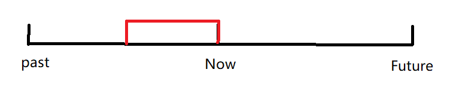
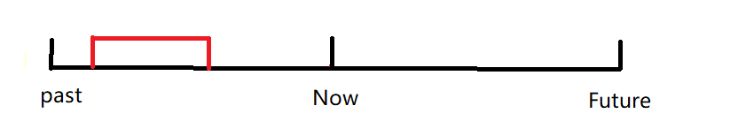
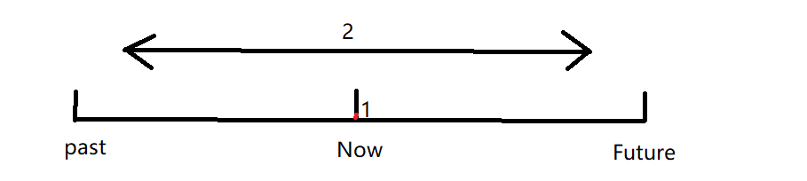
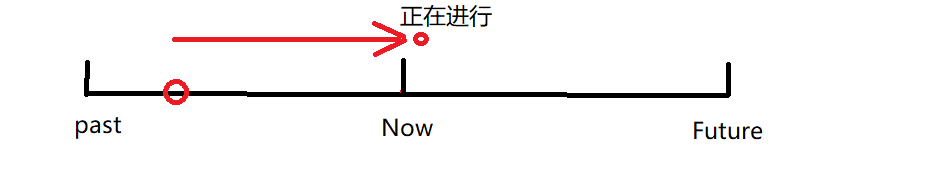

[toc]

 

# 时态：

## be动词的时态变化：

### 一般现在时

#### 第一人称：am

#### 第三人称单数： is

#### 其他： are

### 一般过去时：

#### 第一人称、第三人称单数：was

#### 其他： were

### 现在完成时： been

## 现在完成时

### 时间轴：

现在完成时是表示从过去持续到现在，或者是过去做的事对现在造成了影响 

### 动词状态： 

#### 1.延续性动词：

$$
1、V_{延} : 动作一直持续到现在
$$

#### 2.非延续性动词：

$$
2、 V_{非延} : 过去的动作对现在造成了影响
$$

#### 3.持续发生

$$
当动作从过去到现在持续发生的时候，也要用现在进行时。用次数来表示一个频率，而不用频率副词。\\
当使用频率副词的时候，需要使用一般现在时。现在完成时是使用次数来表示一个频率\\
$$

### 时态标志：

$$
have/has+V_{过去分词}&(实义动词变化形态) \\
have/has+been&(be动词变化形态)
$$

 

### 现在完成时，时间副词：for 、since

两者都是针对现在完成时 

#### for

*   for表示时间段
*   针对时间段的使用How long进行提问

#### since

*   since表示时间点
*   针对时间点的使用when提问

 

## 一般过去时：

表示过去的事情，没有对现在造成影响，只是简单陈述过去的事情，通常跟有过去时间状语，表示过去的时间点，不能跟现在完成时连用 

### 时间轴：

### 和现在完成时进行对比：

$$
I\ have\ lost\ my\ key\quad(现在完成时) \longleftrightarrow I\ lost\ my\ key\ last\ week\quad(一般过去时)
$$

$$
He\ has\ gone\ home\ (现在完成时) \longleftrightarrow He\ went\ home\ tem\ min\ ago\ (一般过去时)
$$

**区别**：一般过去时有明显的时间状语 last week，并且时态为动词过去式，一般过去时看重过去的事情，和现在无关。现在完成时看重现在的情况，过去对现在造成了影响

 

### 时态标志：

$$
was/were+V_{ed}
$$

## 一般现在时：

表示现在的情况，或者表示频率，当表示频率的时候可以表示过去的事情（如果需要表示过去，则需要使用always等频率副词）

### 时间轴：

1.   陈述现有状态
2.   描述从过去到现在到将来，重复的动作，表示频率（当表示频率的时候需要和时间副词连用）

### 时态标志：

$$
be+V_{实}/V_{实}S
$$

## 现在进行时

用来描述现在正在进行的动作，动作尚未结束

### 时间轴 

### 时态标志

$$
am/is/are\ +\ V_{ing}
$$

## 过去进行时

用来描述过去正在进行的事情，动作发生在过去，在过去没有结束。 

### 时间轴 

### 时态标志 

$$
was/were\ +\ V_{ing}
$$

## 现在完成进行时

描述过去发生的事情，一直持续到现在，并且现在仍然在进行

### 时间轴

### 时态标志

$$
have/has\ +\ been\ +\ V_{ing}
$$

## 过去完成时

站在过去看待事件已经完成，需要有两个过去的动词才可以判断是过去完成时，否则无法判断完成的动作是否发生在过去，需要先表明时间是过去时，否则无法判断过去完成时

### 时态标志： 

$$
had\ + V_{过去分词}
$$

### 时间轴

$$
no sooner …… than &              \\
hardly …… when    & 一...就...    \\ 
scarcelt …… when  &              \\
$$

`The teacher had no sooner come in than I arrived `

## 一般将来时

1. already decided plan 等词表示将来的时候，使用be doing 使用现在进行表示将来 
2. already decided 已经决定的时候，表示事情还没有做，可以使用be going to do 来表示将来 
3. just decide 表示一个确定的事情的时候，使用will do 来表示将来
4. fixed 或者time table 固定时刻表的时候，使用一般现在的时态表示将来

5. be to do 
6. be about to do 

## 时态表格

### 主动

|              | 过去                  | 现在                    | 过去将来                                   | 将来 (shall只能用于第一人称)                            |
| ------------ | --------------------- | ----------------------- | ------------------------------------------ | ------------------------------------------------------------ |
| **一般**     | was/were+$V_{过去式}$ | am/is/are+$V/V_{s}$     | 1.would+$V_{原}$  2.was/were going to | 1.will/shall+$V_{原}$ 2.am/is/are+going+to+$V_{原}$ (be going to可以和will结构互换，但是通常用will) 3.am/is/are+$V_{ing}$(现在进行表将来) 4.am/is/are+$V/V_{s}$(一般现在表将来) 5.am/is/are+to+$V_{原}$ 6.am/is/are+about+to+$V_{原}$ (不跟将来的时间状语连用) |
| **进行**     | was/were+$V_{ing}$    | am/is/are+$V_{ing}$     | —————————————————————                      | will/shall+be+$V_{ing}$                                      |
| **完成**     | had+$V_{过去分词}$    | have/has+$V_{过去分词}$ | —————————————————————                      | will/shall+have+$V_{过去分词}$                               |
| **完成进行** | had+been+$V_{ing}$    | have/has+been+$V_{ing}$ | —————————————————————                      | ——————————————————————————————————————————                   |

### 被动

|          | 过去                          | 现在                           | 过去将来                | 将来(shall只能用于第一人称)         |
| -------- | ----------------------------- | ------------------------------ | ----------------------- | ----------------------------------- |
| **一般** | was/were+$V_{过去分词}$       | am/is/are+$V_{过去分词}$       | would+be+$V_{过去分词}$ | will/shall+be+$V_{过去分词}$        |
| **进行** | was/were+being+$V_{过去分词}$ | am/is/are+being+$V_{过去分词}$ | —————————————————       | —————————————————————————————       |
| **完成** | had+been+$V_{过去分词}$       | have/has+been+$V_{过去分词}$   | —————————————————       | will/shall+have+been+$V_{过去分词}$ |

`be used to do` 被用来做... 

`be used to doing` 习惯于... 

`used to do ` 过去常常...

