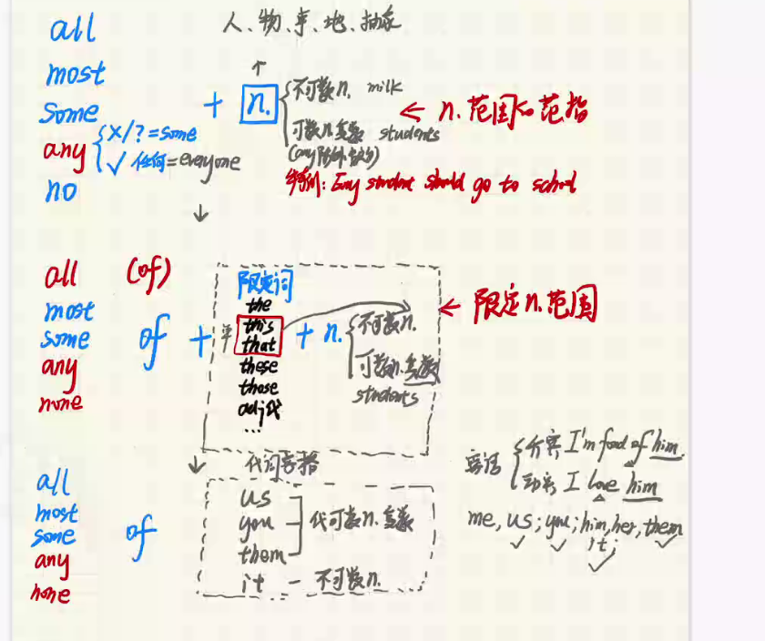

[toc]

# 代词

## 人称代词

| 主格 | 宾格 |
| ---- | ---- |
| I    | me   |
| we   | us   |
| you  | you  |
| he   | him  |
| she  | her  |
| it   | it   |
| they | them |

人称代词中，主格做主语，宾格做宾语。
$$
\underbrace{I}_{主格}\ love\ \underbrace{him}_{宾格}
$$

$$
\underbrace{I}_{主格}\ am\ ford\ for\underbrace{him}_{做介词for的宾语}
$$

## 物主代词

| 形容词性物主代词 | 名词性物主代词 |
| ---------------- | -------------- |
| my               | mine           |
| our              | ours           |
| your             | yours          |
| his              | his            |
| her              | hers           |
| its              | its            |
| their            | theirs         |

形容词性的物主代词相当于一个形容词，后需要加名词
$$
This\ is\ \underbrace{my}_{adj.代}\ book
$$
名词性物主代词相当于一个名词的用法
$$
This\ book\ is\ \underbrace{mine}_{n.代}\ \ \ \ (mine相当于my\ book)
$$

## 反身代词：

| 反身代词   | own      |
| ---------- | -------- |
| myself     | my own   |
| ourselves  | our own  |
| yourself   | your own |
| yourselves |          |
| himselves  | his own  |
| herselves  | her own  |
| itsselves  | its own  |
| themselves | them own |

### on和反身代词的区别

`my own` 后可以直接加名词，表示拥有关系
`myself` 只能表示自己
$$
He\ loves\ himself\ \ 使用反身代词表示自己\\ 
He\ loves\ his\ own\ book\ \ 表示所属关系的物品\\
$$
`my own` 后可以直接加名词

`myself`后不可以直接加名词，直接做一个宾语
$$
固定搭配： \\ 
on\ my\ own \\ 
by\ myself \\
$$

## 名词所有格

### 's引用所有格

$$
My\ friend's\ house \ \ ——>\ his\ house \\
My\ friends'\ house \ \ ——>\ their\ house\\
$$
其中`'s`代表的是一个人的所有物,`s'`代表的是一群人的所有物。

$$
n's\ +n.\ 单数\\
ns'\ +n.\ 复数\\
$$

### of引用所有格

$$
Look\ at\ the\ roof\ of\ the\ building 
$$

由of引导的物体的所有格主要用于无生命的物体，表示从属关系。

$$
A\ friend\ of\ mine
$$
当强调其中的一个的时候，也使用of进行引导，此时构成了`one of`句型。

$$
A\ friend\ of\ my\ sister's\ \ \ ——> (省略了friends,完整句型应该是of\ my\ sister's\ friends)
$$
双从所有格，表示很多当中的其中一个。

## 指示代词

### this

后只能接单数，近指 

### that

后只能接单数，远指 

### these

后只能接复数，近指 

### those

后只能接复数，远指 

## 替代词：

### one（单数）

$$
These\ chocolates\ are\ good,\ Would\ you\ like\ one?
$$

### ones（复数）

当使用`one`指代的时候，指代上述名词中的其中一个，只能指代单数。

`ones`和`one`的使用方法一样，但是`ones`指代复数

## 不定代词：

### some、any、no、none

$$
直接加n.
\begin{cases}
all& &  &   \\ 
most& & &\\ 
some&  + &n.\cases{n._{可数复数}\\n._{不可数}\\any除肯定句} \\ 
any\cases{否定或疑问=some \\肯定句=every }&    \\ 
no&    \\
\end{cases}
$$

$$
使用of和限定词
\begin{cases}
all  & (+of)\ & &                                              & & &  \\
most & &\   \ & &                                              & & &  \\
some & +\ of\ + \cases{the\\this\\that\\these\\those\\adj_{代}}& + n.\ \cases{n._{可数复数}\\n._{不可数}}\\ 
any  & &\   \ & &                                              & & &  \\ 
none & &\   \ & &                                              & & &  \\
\end{cases}
$$

$$
使用代词宾格
\begin{cases}
all  & & & &  &                                                              \\ 
most & & & &  &                                                              \\ 
some & + & of & \cases{
\begin{Bmatrix} 
us   &                      \\
them &                      \\
you  &        
\end{Bmatrix}  代表可数名词的复数            \\
it \ \ \ \ \ \ \ \ \ \ \ \ \ \  \rbrace  +不可数名词}   \\
any  & & & &  &                                                              \\
no   & & & &  &                                                               \\ 
\end{cases}
$$

#### no any 、no 、 none 

`none=0` 只在描述数量的时候使用none，通常使用`How much`提问 

`not any = no` 
$$
I\ don't\ have\ any\ homework ==\ I\ have\ no\ homework
$$

|          | one     | body     | thing     |
| -------- | ------- | -------- | --------- |
| **some** | someone | somebody | something |
| **any**  | anyone  | anybody  | anything  |
| **no**   | no-one  | nobody   | nothing   |

####  some和any

否定句some变any，疑问句也需要变any 
$$
I'm\ going\ to\ buy\ some\ clorote 
$$
在需要得到肯定回答的时候，疑问句还是用some 
$$
some+n_{可数复数}/n_{不可数}
$$
当any用在肯定句的时候表示任何，和every用法一样

### every、all

every 指每一个，后通常加单数或者不可数 

all 后加复数 

every county 每个国家

all county 所有国家

all the counties 限定国家，有限的范围 

every day 每一天，表示频率 

all day 一整天，表示完整性 

`It rained every day last week` 

`It rained all day yesterday`

### all、whole

all后通常加不可数名词 

whole后加可数名词单数，把可数名词作为一个整体 
$$
a\ whole\ book \\
all\ the\ money  \\
$$

### 定冠词the

有限定的含义 

`Children like playing` 全天下所有的孩子

`Where are the children` 我们的孩子

### both、either、neither

$$
\begin{cases}
both    &(A和B都) & +  & n_{可数复数}& + & V_{复}\cases{be:are\\V_{实}：V_{原}} \\
either  &(A可以或者B可以) & +  & n_{可数单数}& + & V_{单}\cases{be:is\\V_{实}：V_{S}}   \\
neither &(A不可以或者B不可以) & +  & n_{可数单数}& + & V_{单}\cases{be:is\\V_{实}：V_{S}}   \\
\end{cases}
$$

$$
both    & 两者都         \\
either  & 两者其中一个    \\ 
neither & 两者都不       \\
$$

$$
\begin{cases}
both    &  + & (of) &    \\
either  &  + & of   & + \cases {the\\these\\those\\my\\our}  & (可以是复数)   \\ 
neither &  + & of   &       \\
\end{cases}
$$

### a lot of、much、many、plenty of

$$
a\ lot\ of\ +n_{不可数}/n_{可数复数}  \\ 
many\ +n_{可数复数} &\ 表示许多\\
much\ +n_{不可数} \\
plenty\ of+n_{不可数}/n_{可数复数} & 表示足够多\\
$$
`much` 不常用与肯定句，需要使用肯定句的时候使用`a lot of` 

`many`和`much`的使用方法一样 

`plenty of`和`a lot of` 用法一样，在数量上比`a lot of`要多

### (a) little、(a) few

$$
(a) & little & + & n_{不可数} \\
(a) & few    & + & n_{可数复数} \\
$$

`a little`和`a few`与`some`意思相同

### eatch、every

## 关系代词：

which……的物， who……的人， that……的人或物， who谁， that引导定语从句

## 相互代词

each other 互相， one another互相

## 连接代词：

who,whom,whose,what,which,whatever,whichever,whoever,whomever

## 疑问代词：

who谁， what什么， which哪个，when什么时候，how如何；怎样，how much多少钱，how many多少个

