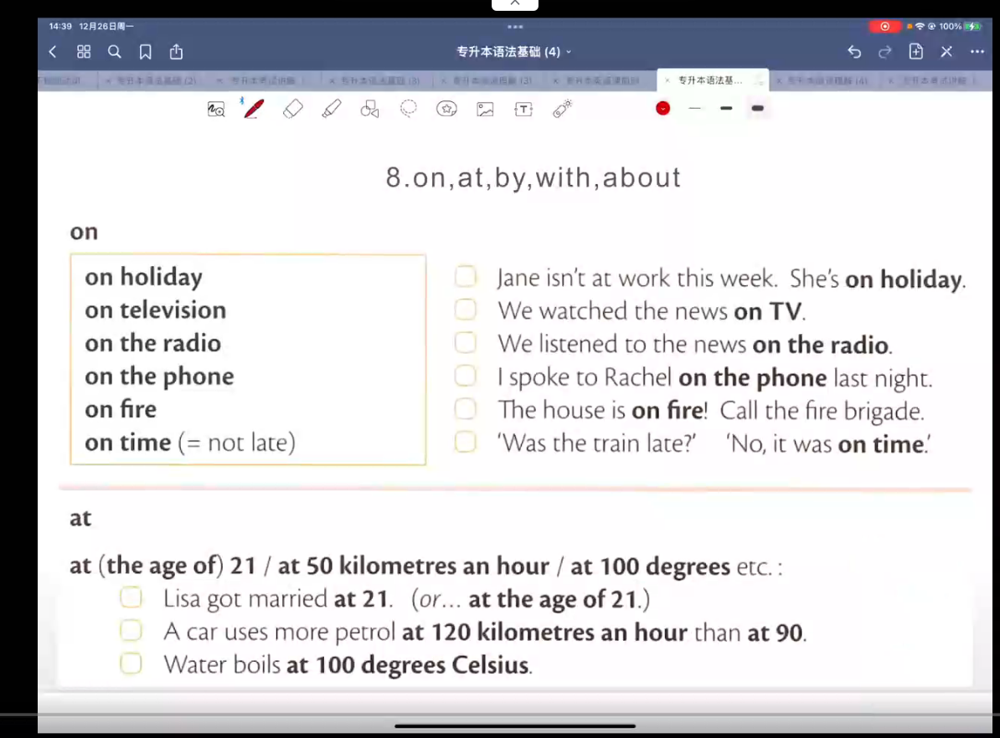
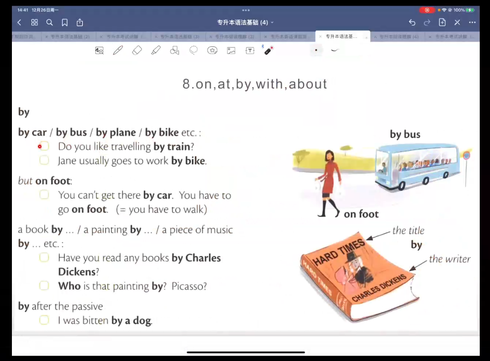
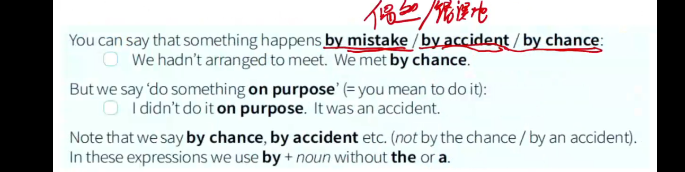
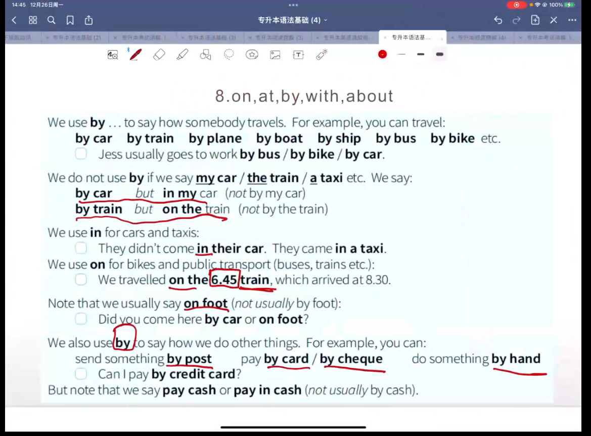
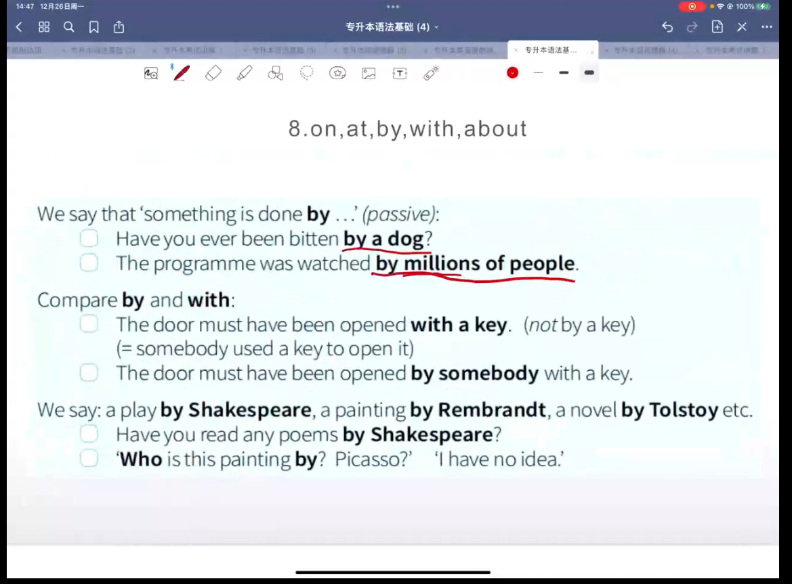
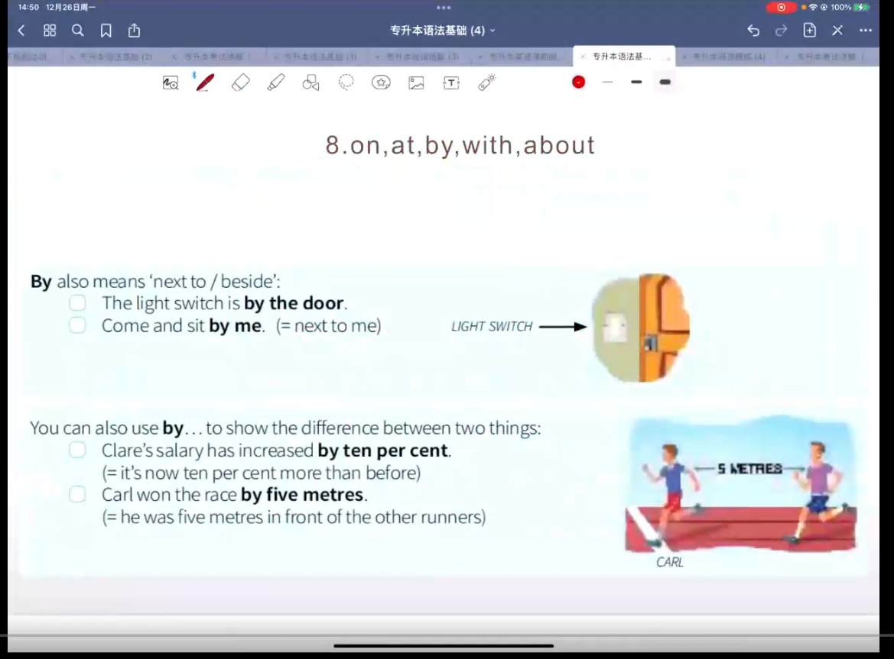
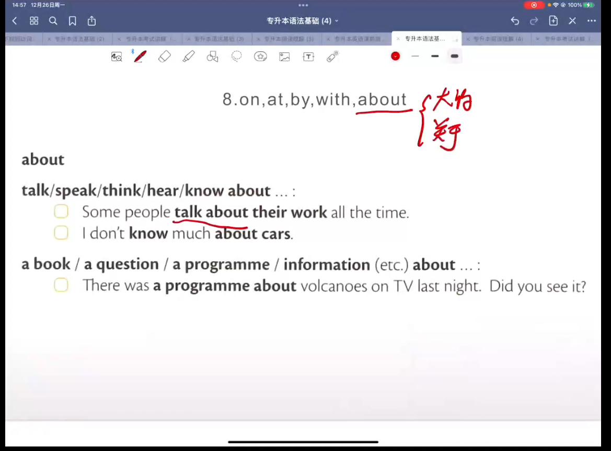
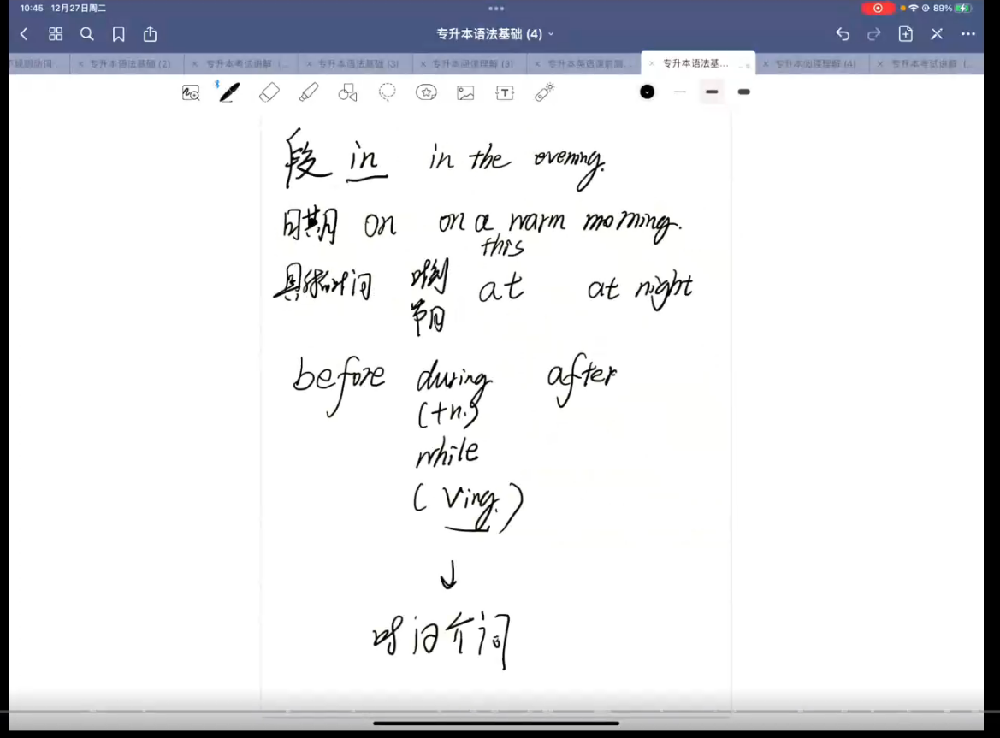

[toc]


# 介词

## at , on , in 时间

at 时刻 比较短的时间

    * at the weekend 
    * at night 
    * at Christmas 
    * at eht end of 
    * at the moment 

on 日期 天 ,确定的某一天

    * on Monday morning 
    * on Tuesday afternoon 
    * on Friday evening 
    * on Saturday night 

in 时间段 比较长的时间  

    * in the morning 
    * in the afternoon 
    * in the evening 


### use at / on / in before 
用来表示时态

   * this 完成时 一般过去 判断时态需要判断现在所处的位置 
   * last 一般过去时
   * next 将来的时间 
   * every 一般现在时

in five minutes 

in a few days 

in six weeks 

in two years 

### 时间的表述方式：

11:45 

past (过) 

to (过了) 

半 half 

a quarter (15分钟) 


### 例题： 

```
on 6 june 

in the evening 

at half past two 

on Wednesday 

in 2007 

in Sepetember 

on 24 September 

on Thursday 

at 11.45 

on Christmas Day 

in Christmas 

in the morning 

on Friday morning 
```


## on time , in time , too late , just in time 

on time 准时

> the 11.45 train left on time 


in time 及时 足够快 

> I sent Amy a birthday present,I hope it arrives in time 


too late 太晚了 

> I got home too late to watch the game on TV  可以组成too to 结构，太...而不能 


just in time 刚刚好 

> We got to the station just in time for our train 

## at the end (of) , in the end (of) , at first

at the end 
> I'm going away at the end of January 

at the end of 在...的结束 

at the begining of 在...的开始 

in the end 最后 
> We had a lot of problems withe our car.We sold it in the end 

at first 起初 
> At first we didn't get on very we,but in the end we became good friends 

## from...to , until , since , for 

### from...to 
from...to  从...到 (前后保持时间一致性)
> We lived in japan from 2003 to 2010 
> I work from Monday to Friday 

from...until 从...直到

> We lived in japan from 2003 until 2010

### until 

until... (直到)

> They're going away tomorrow.They'll be away until Friday  

> Wait here until I come back 

till == until 

> Wait here till I come back 

### 时间段的区别： 
```
How long will you be away ? 询问时间段
    Until Monday 
```

```
When are you coming back ?  询问时间点
    On Monday 
```

### since 

since + a time in the past(to now)  自从...到现在 后面加一个时间点 

> Sue and Dave have been married since 1998.

> It has been raining since since I arrived. 

#### 区别： 

> We Lived in japan from 2003 to 2010 

> We lived in japan until 2010 

> Now we live in Canada. We came to Canada in 2010 

> We have lived in Canada since 2010 (=from 2010 to Now) 


### for 
for + 时间段 在...期间 

* for three days 

* for ten years 

* for five minutes 

> joe has been in hispital for three days 


## before , during , while , after 

### before

before 在...之前 后可以强调事情也可以强调动作
> Everybody feels nervous before exams 

### during 

during 在...期间 强调某一个事件期间

during + n. 

> I fell asleep during the film  

### while

while 在...期间 强调某一个动作 ,  后一般加一个句子 

while + v.

> I often fall asleep while I'm reading 

### after

after 在...之后 后可以强调事情也可以强调动作 
> We were tired after our visit to the museum 


befor/after + v-ing 采用了非谓语的形式，使用v-ing而不是to do 
> I always have breakfast befor going to work (=before I go to work)
> After doing the shopping,they went home (=after the did) 


## in , at , on 地点


### in


in 在...里面 ，在某个空间的中心 

* in a room 
* in a shop 
* in a car 
* in the water 

in 在某个地点中 存在一个范围 

* in a garden 
* in a town 
* in the city centre 
* in Brazil 


> Where's David ? In the kitchen 
>
> What's in that box 
>
> I live in a big city, but I'd like to live in the country 


### at


in 在一个具体的地点

* at the bus stop 
* at the door 
* at the traffic lights 
* at her desk 

> There's somebody at the bus stop 
>
> The car is waiting a the traffic lights 


#### at the top , at the bottoom , at the end (of ... )

> Write your name at the top of the page 
>
> My house is at the end of the street 


### on


on 在某个物体的表面 

* on a shelf 
* on a plate 
* on a balcony 
* on the floor 
* on a wall 
* on a door 

> There are some books on the shelf and some pictures on the wall 
>
> There are a lot of apples on those trees 
>
> There is a stamp on the envelope 

#### on a horse , on a bicycle , on a motorbike 

> Who is that man on the motorbike 


### in at 比较

> There were a lot of people in the shop . It was crowed 
>
> Go along this road , then turn left at the shop 


### in on 比较

> There is some water in the bottle 
>
> There is a label on the bottle 


### at on 比较

> There is somebody at the door , shall I go and see who it is ? 
>
> There is a notice on the door . It says 'Do not disturb'


### in at 特殊含义

#### in

强调的是空间概念，可以地点和事件结合

* in bed 在床上 
* in hospital  在医院
* in prison 在

天气笼罩人，天气也可以使用in ，心情也是同样笼罩人，也使用in

*  in the rain 
* in the sun 
* in the shade
* in love  
* in dollars 
* in a bad mood 
* in my opinion 


#### at

at 在某个地点，某个娱乐场所，强调地点场所使用at 

* at home 在家里 
* at work 在工作
* at school  在学校 

精确的数值使用at 

* at the age of 16 


#### be at , do at

* be home 在家里，表示一个状态
* be at home 加at强调一个在家的状态
* eat at home 在家吃，at强调地点


### on 的特殊含义

on 强调一个表面，在...表面，不强调空间可以使用on ,是一个比较单一的东西 


 表示方向

* on the left 
* on the right 

表示表面

* on a map 
* on a menu 
* on a list 

表示一个地方

* on the coast 
* on a road 
* on a river 


## to , in , at , into 地点

### to

to 有一个目的地 ，有一 个位置的移动 

go to 去往某地  

* go to China 
* go back to Italy 
* go to work
* go to the bank 
* go to a party 

come to 回到 

* come to my house 

return to 返回到 某地 

walk to 步行到某地 


### in 

in 在某个地方的描述，没有位置的移动 ，比较大的地域的范围 

in 在...中心 通常为城市，国家，等一些大地方，一个地域的范围

* in London 
* live in Italy 


### at

at 在一个详细的地方的描述，没有位置的移动，比较小的位置范围 

一般为比较小的位置，有一个具体的位置

* at the airport 
* at work 
* at the party 
* at her borther's house 


### arrive

arrive 到达 

arrive in 一个比较大的位置 

arrive at 一个比较小的地方 

* arrive in Italy 
* arrive at the station 
* arrive at the hotel 


### get

get to 到达

* get to the hotel 
* get to Paris 
* get home 


### into 

into 到里面  强调的是里面

go into , get into 

* went into the room 
* flew into the kitchen
* into my bank account 


### out of

out of 出去 和into构成反义词 

* got out of the car 
* went into a shop 


### get on , get off 

get on 上车 

get off 下车 通常后面是交通工具 


## under , behind , opposite 


### next to , beside , between , in front of , behind


netxt to 在...旁边

beside 在...旁边

between 在...中间

in front of 在...前面 

behind 在...后面 


### opposite , in front of 


in front of 在...前面

opposite 面对面 


### by

by 在...旁边 


### under 

under 在...下面

* under the tree 

> the car  is under the table 


### above , below


above 在...之上

below 在...之下 

两者都不是绝对的正下方和正上方，只是一个大概的位置


## up , over , through


### to , from , into , out of , on , off


#### to , from

to 从外面到里面，强调目的地

from 来自外面，来源地是外面，强调来源  


#### into ,  out of 

into 去到目的地里面，强调里面

out of  从里面出去，强调跳出目的地 


#### on , off 

on 强调打开，激活，放上等正向动作

off 强调关闭，取消，拿下等反向动作 


### up , down , over , under , through , round , round the town


#### up , down 

up 向上 ，只要是向上就可以是up

down 向下 


### over , under

over 正上方，强调正上方 ，还可以是从上方越过，飞跃等意思 

under  正下方 ， 强调正下方， 还可以是从下方穿过 


#### through , round , around 

through  从里面穿过 

round 环绕 

around 围绕，和round 的意思可以是一样的 


### along , across , past 

along 沿着

across 横跨 

past 经过 


## on , at , by , with , about 


### on 



一般都是比较单一的 


### at 

跟 速度 年龄 


### by 

在...的附近 可以用by来使用交通工具




可以加人名 by 

也可以使用被动语态 ，被某某某 怎么样 




固定搭配 

by mistake 

by accident 

by chance 




by 直接加名词 可以使用交通工具 

但是on foot是特例 

可以加作家后者画家的名字，作为著作

by可以有通过的意思 ，by post  ， by card ， by cheque 





也可以使用被动语态，by 后面是跟被操作对象 

with 后面是和的意思  和某人一起  或者和某物一起 





表示旁边的意思 ， 在...的旁边 

还可以表示 具体的区别 


### about 

大约 关于 



动词+about 

名词+about 

两者后面都可以表关于 


### 总结：

on 

1. 单一的线路  

at 

1. 比较具体的地点 

by 

1. 在....旁边 == next to 
2. 加交通工具，使用交通工具 ， by car , by bus 
3. 支付 by card , 但是设计到钱币,现金 就不能用by，需要使用 pay in cash 
4. 具体的差异
5. 固定搭配， by mistake , by accident , by chance 
6. 被动语态，被某人.... 

with 

1. 和某人一起 ，有和的意思 
2. without 不和某人一起 或者不和某物一起


## 总结

### 时间介词

时间段： in 

日期： on 

具体的时间，时刻： at

 在...之前： before 

在...中间： during(强调后面加一个名词) , while(后面可以加一个动词) 

在...之后： after 




### 方位介词 

空间，地域： in 


