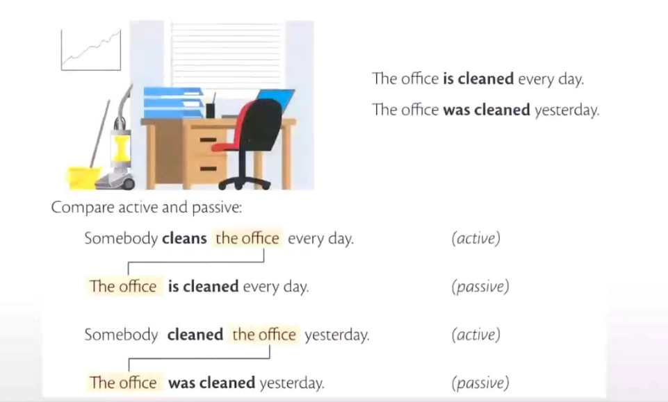
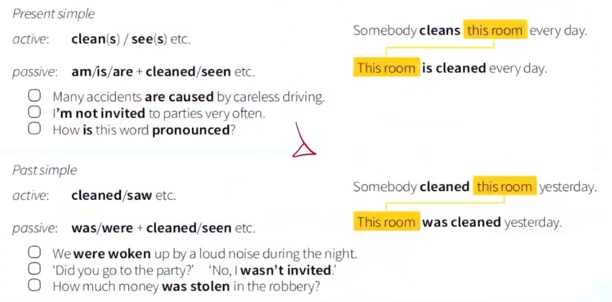
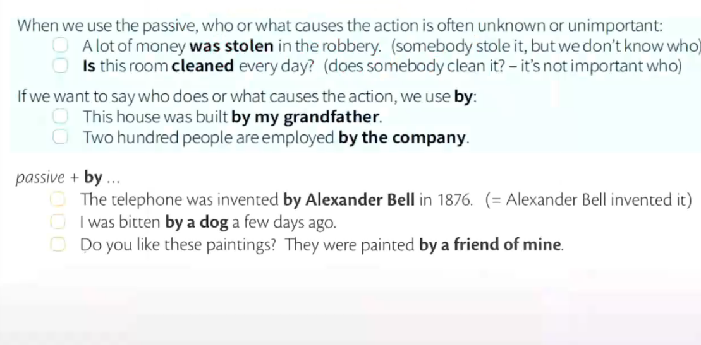
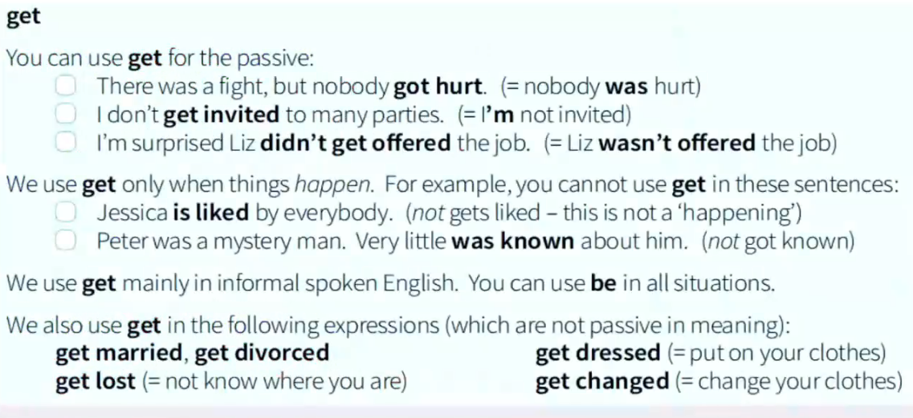
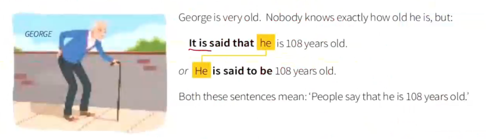
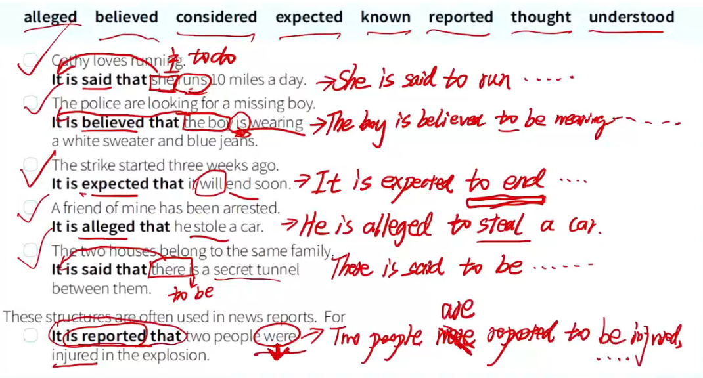
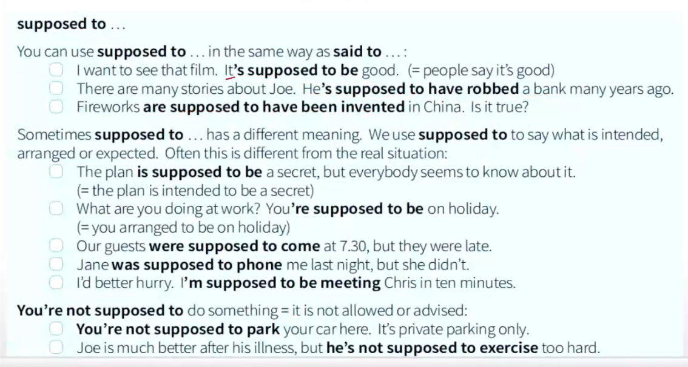

[toc]

# 被动语态

## 常见结构

$$
be\ +\ done
$$

一般句型结构为主系表结构，

## 一般现在时

### 句型结构 

$$
am/is/are\ +\ V_{过去分词}
$$

How is this word pronounced ? 

This room is cleaned every day . 

## 一般过去时

### 句型结构

$$
was/were\ + V_{过去分词}
$$

we were worken up by a loud noise during the night 

## by 用法

在不知道某物品的操作人的时候，就可以使用被动语态，表示某物品被.... 

如果需要在被动语态中加上操作人，则使用by 来加一个操作人，当使用by了则表明有直接操作

## 现在完成时

### 句型结构 

$$
have/has \ + \  V_{过去分词} \\ 
have/has \ +\ been \ + \ V_{过去分词}
$$

## 过去完成时

### 句型结构

$$
had\ + \ V_{过去分词} \\ 
had\ + \ been \ + \ V_{过去分词} \\
$$

## 双宾语被动

$$
双宾语例子：He\ \ give\ \ the\ \ girl\ \ a\ \ book\ \\ 
他给了那个女孩一本书： 书是直接动作对象 \\ 
变被动:A\ \ book\ \ was\ \ given\ \ to\ \ the\ \ girl\ \ by\ \ him \\
或者:The\ \ girl\ \ was\ \ given\ \ a\ \ book\ \ by\ \ him 
$$

He 主语

give 谓语动词

the girl 间接宾语

a book 直接宾语

$$
单个宾语例子： he\ \ ate\ \ an\ \ apple \\
他吃了一个苹果 \\
变被动：An\ \ apple\ \ was\ \ eaten \ \ by\ \ him \\
苹果被吃 ：苹果是动作直接对象
$$

## 动词后变被动 

$$
I\ \ don't\ \ like\ \ doing\ \ something \\ 
变被动： doing--> being\ \ done \\
(被动的结构是be\ \ done,do变为done表被动，保留V_{ing}所以be变为being)
$$

## get 

## 被动语态常用句型 

$$
It\ \ is\ \ said 	\ \ that\ \ 据说 		\\ 
It\ \ is\ \ believed\ \ that\ \ 大家相信   \\ 
It\ \ is\ \ expected\ \ that\ \ 预计 		\\
It\ \ is\ \ alleged	\ \ that\ \ 据称 		\\
It\ \ is\ \ reported\ \ that\ \ 据报道
$$

### supposed to 据说

## 被动语态事态变化表格

|          | 过去                          | 现在                           | 将来                                |
| -------- | ----------------------------- | ------------------------------ | ----------------------------------- |
| **一般** | was/were+$V_{过去分词}$       | am/is/are+$V_{过去分词}$       | will/shall+be+$V_{过去分词}$        |
| **进行** | was/were+being+$V_{过去分词}$ | am/is/are+being+$V_{过去分词}$ | null                                |
| **完成** | had+been+$V_{过去分词}$       | have/has+been+$V_{过去分词}$   | will/shall+have+been+$V_{过去分词}$ |
