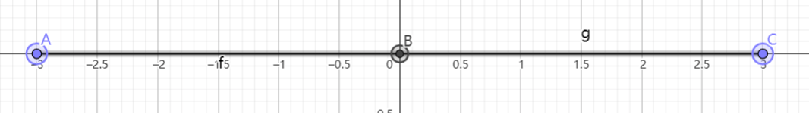

[toc]

# 有理数

## 正负数： 1 -1 

## 有理数的定义： 

正整数，负整数，0都被称为有理数

$$
有理数:
\begin{cases}
正有理数 \begin{cases} 正整数 \\ 正分数 \end{cases} \\ 
0 	\\
负有理数 \begin{cases} 负整数 \\ 负分数 \end{cases} \\ 
\end{cases}
$$

## 相反数： 

$$
a+b=0 \longrightarrow a=-b \\ 
其中a和b互为相反数
$$

## 绝对值 

$$
\left\vert a \right\vert \begin{cases} a \ (a>0) \\ 0\ (a=0) \\ -a\ (a<0)\end{cases}  \\ 
\\
\\
\left\vert 3 \right\vert = 3  \\
\left\vert 0 \right\vert = 0  \\ 
\left\vert -3 \right\vert = 3 \\
\\
\\
-3>-5 \longrightarrow \left\vert -3 \right\vert <\left\vert -5 \right\vert
$$

一个数的绝对值，代表了一个点到原点的长度

## 有理数的加法：

$$
a+b=b+a \\ 
a(b+c)=(a+b)+c \\
$$

## 有理数的减法：

$$
a-b=a+(-b) \\ 
a-b+c-d=a+(-b)+c+(-d)
$$

## 有理数的乘法：

### 同号为正，异号为负

$$
a \times b = c \\  
a \times (-b) = -c \\  
-a \times b = -c \\
-a \times b = c 
$$

## 倒数：　

$$
a \times b = 1 \ \ 则两个数字互为倒数  \\ 
$$

$$
a(b \pm c) = a \times b \pm a \times c  
$$

### 乘法交换律:

$$
ab=ba \\ 
a\times b \times c = (a\times b)\times c = a\times (b\times c ) \\
$$

## 乘方： 

$$
a^n=底数^{指数} = 幂
$$

### 指数对数转换

$$
a^b=N \longrightarrow \log_{a}N=b
$$

>   运算规律： 先乘方，再乘除，再加减
>
>   同级运算：从左至右 
>
>   有括号需要先算括号里面的内容

