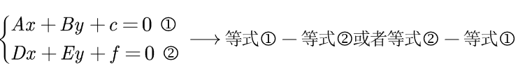

# 二元一次方程组

$$
\left\{ \begin{array}{l}
	Ax+By+c=0\\
	Dx+Ey+f=0\\
\end{array} \right. \longrightarrow \text{二元一次方程标准格式}
$$

## 消元法

将其中一个等式的x或者y转化为x=……或者y=……然后带入另一个二元一次方程，使其变为一元一次方程，然后求解 

## 加减消元法

其中两个等式之间也可也做加法

